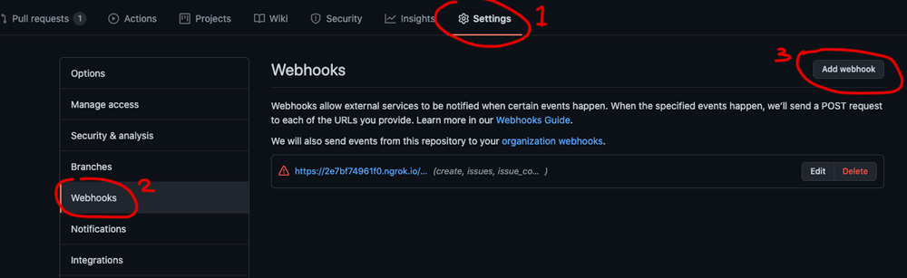

# React Raccoon Bot

The bot helps developers that are working collaboratively on a project residing on GitHub repository by notifying them on Discord channel each time there is PRs, Reviews or Comments on that repo. It also sends motivation quotes at intervals (Morning, Afternoon and Evening).


## Getting Started

These instructions will get you a copy of the project up and running on your local machine for development and testing purposes.

### Prerequisites

- Make sure [Node.js](https://nodejs.org/en/download/) is running on your local machine.
- A registered [Discord](https://discord.com/) account

### Setup

~~~bash
$ git clone https://github.com/MLH-Fellowship/pod3.1.4-DiscordBot.git
$ cd pod3.1.4-DiscordBot
$ git checkout -b <new-branch>
~~~

Install modules:

```
yarn or npm install
```

**Run Bot**
Create a `.env` file in the root of the folder and add `TOKEN=xxxxxx`

``` 
npm run start
```

**Note**: To get started with your own bot visit the [discord app page](https://discord.com/developers/applications) and create a new application. Click on the newly created application, from there you should be able to get your newly created bot token.

## Useful commands

Switch branches:
```
git checkout <branch-name>
```

Make new branch and switch to it:
```
git checkout -b <branch-name>
```

Fix eslint errors:
```
npm run lint
```

Log in to server

**Note** You can set this up on any cloud server of your choice, for this app, we use debian OS provided by [Linode](https://www.linode.com/), it comes with Node preinstalled which is good for us.


```
ssh root@172.xxx.xxx.xxx
```

You will need to install additional packages like git in order to clone the repo. Checkout this [article](https://linuxize.com/post/how-to-install-git-on-debian-9/) on how to install git on debian

Another usefull package you may want to install is the [Process Manager 2](https://github.com/Unitech/pm2), this will allow us to run our server in the background even when we logged out of the server so our bot will still remain online.

Run the program 
```
pm2 --name DiscordBot start npm -- start
```

List Running Process
```
pm2 ps
```

Stop Process - 0 is the index
```
pm2 delete 0 
```

Check logs
```
pm2 logs
```

For our custom webhook, we're currently using [ngrok](https://ngrok.com/), you can get started for free, signup and get your token.
- Download [ngrok](https://ngrok.com/download) to a path of your choice, you will need to always run it from that path
- `wget https://bin.equinox.io/c/4VmDzA7iaHb/ngrok-stable-linux-amd64.zip` for linux server, the page provides options for other OS
- unzip it to that directory and add your authentication token using `./ngrok authtoken <your_auth_token>`
- Before starting ngrok, make sure your app is running already, by default it runs on port 3000
- Just like our app, we want to make sure ngrok is also running in the background: `./ngrok http 3000 -log=stdout > ngrok.log &`
- To check the generated public URL, use `cat ngrok.log` copy the one with **https**
- Go to the repo you want your bot to be sending updates and add the url to the webhook section, see image below
- Make sure to add `/github` at the end of the url

Find the process ID with ngrok 
```
ps -A
```

Terminate ngrok background process.
```
sudo kill -9 3348
```



# Authors

👤 **Uduak Essien**

- Github: [@acushlakoncept](https://github.com/acushlakoncept/)
- Twitter: [@acushlakoncept](https://twitter.com/acushlakoncept)
- Linkedin: [acushlakoncept](https://www.linkedin.com/in/acushlakoncept/)

👤 **Ajiboye Adedotun**

- Github:[@Youngprinnce](https://github.com/Youngprinnce)
- Twitter:[@Youngprinnce](#)
- LinkedIn:[Ajiboye Adedotun](https://www.linkedin.com/in/ajiboye-adedotun/)


👤 **Sebastian Holguin**

- Github:[@sebastian-holguin](https://github.com/somoye123)
- Twitter:[@sebastian-holguin](#)
- LinkedIn:[Sebastian Holguin](https://www.linkedin.com/in/sebastianholguin/)

## Show your support

Give a ⭐️ if you like this project!

## 🤝 Contributing

Contributions, issues and feature requests are welcome!

Feel free to check the [issues page](issues/).

## Acknowledgement

MLH Pre-Fellowship Program